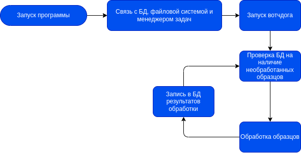

# Общий алгоритм работы

# Инициализация программы

При инициализации программа устанавливает связь с MongoDB, менеджером задач Slurm и проверяет доступность папок для входных и выходных данных.

## Связь с MongoDB

# csp_nanopore_workflows

 Workflows for processing Nanopore reads with Nextflow implementation

#### to_do

add slurm options:

#SBATCH --time=1:00:00                # Maximum runtime (D-HH:MM:SS)

#SBATCH --mail-type=END               # Send email at job completion

#SBATCH --mail-user=your@email.com    # Email address for notifications

**-a** ,  **--array** =< *indexes* >

**--cpus-per-gpu** =< *ncpus* >

**-c** ,  **--cpus-per-task** =< *ncpus* > !!!!

**--kill-on-invalid-dep** =<yes|no>

--time

--begin

align:
    samtools_index: -@ 4 -> -@ params.threads

каждое задание имеет свою отдельную входную (касается nxf, который должен выполняться в отдельной папке) и выходную директорию

рестарт дропнутых заданий

 ADD RETRY OF TASK TO SLURM

crawler:

* доделать работу с ранее проиндексированными файлами: сравнение при инициалиазации с ранее сохранённой в БД метой, действия при добавлени/удалении/модификации файлов (см. index_source_files() в filesystem.py)
